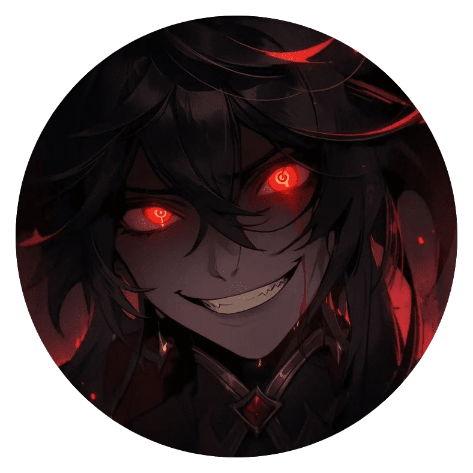

  
  <h2 align="center">Analog Sombra</h2>
  
🏆Hey there! 👋 Welcome to my GitHub! I'm the ultimate combo of lazy and genius in the coding world. You'll often find me coding from the comfort of my couch, fueled by coffee and memes. My code? It's a work of art...eventually.

Stick around, grab a snack, and join me on my quest to change the world, one lazy line of code at a time! 😉✨

<h1 align="center">Hi There, Analog Sombra here 👋</h1>

- 🌱 I’m currently learning **App Development And New Tech**

- 👨‍💻 All of my projects are available at [Analog Sombra](https://github.com/analog-sombra)

- 💬 Ask me about **App Development and Web Development**

- 📫 How to reach me **analogsombra@gmail.com**

- ⚡ Fun fact **I can learn anything fast, able to write with my both hand**

- 📄 Know about my experiences [analogsombra.com](https://analogsombra.com)

<b> Know more about me</b>

