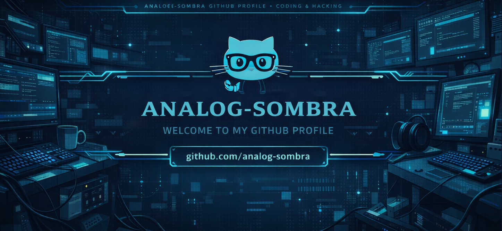
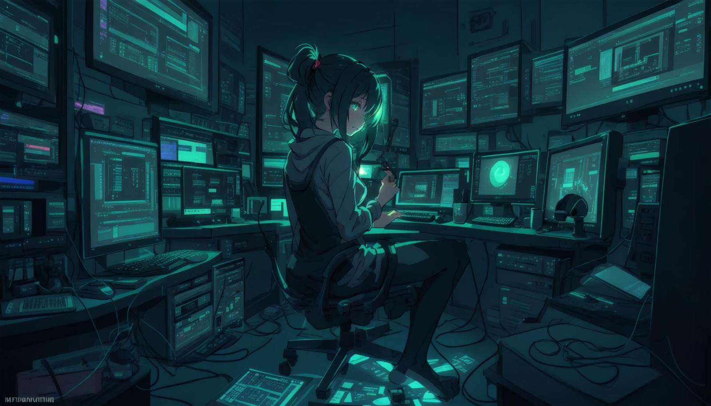

<div align="center" style="text-align:center;">

</div>
<h1 align="center">Hi There 👋 I'm Analog Sombra</h1>

<p align="center">
<strong>🏆 Home of lazy ideas and accidentally brilliant code.</strong>
<br/><br/>
I’m the ultimate combo of 🛋️ lazy and 🧠 genius in the coding world. You’ll usually find me coding from the comfort of my couch, powered by coffee ☕, memes, and questionable motivation. My code? It starts messy, looks suspicious, and somehow ends up working… beautifully. Eventually.
<br/><br/>
Stick around, grab a snack 🍿, and join me on my quest to change the world — one lazy line of code at a time. 😉✨
</p>

---

<p align="center">
  Professional procrastinator 🤝 accidental software engineer
</p>

---

### 😴 About Me (read this while I nap)

- 🌱 Currently “learning” **App Development & New Tech** (mostly by breaking things)
- 👨‍💻 My projects live here 👉 [github.com/analog-sombra](https://github.com/analog-sombra)
- 💬 Ask me about **App Dev, Web Dev, or why my code works**
- 📫 Reach me at **analogsombra@gmail.com**
- ⚡ Fun fact: **Fast learner, ambidextrous, still lazy**

---

### 🧪 Philosophy

> Write less code.  
> Think more.  
> Sleep when it compiles.

---

### 🛠 Tech Stack

```js
const analogSombra = {
  languages: ["JavaScript", "TypeScript", "Rust", "C++", "Kotlin"],
  frontend: ["React", "Next.js", "Flutter"],
  backend: ["Node.js", "NestJS", "SQL", "Prisma", "PostgreSQL"],
  tools: ["Git", "Linux", "Windows", "VSCode", "Android Studio"],
  mindset: "Lazy but effective",
};
```

<p align="center">
  Developer | Builder | Curious Mind
</p>

<div align="center" style="text-align:center;">

</div>
<hr/>

## GitHub Stats

<table style="border: 0px;"><tbody><tr border="none"><td width="50%" align="center">


</td><td width="50%" align="center">
</td></tr></tbody></table>

### 📈 Activity Graph:

<div align="center" style="text-align:center;">

</div>

[](https://github.com/analog-sombra/github-readme-activity-graph)

<b> My Social Media</b>

<table>
  <tr>
    <td width="55%" valign="top">
| Platform   | Link |
|-----------|------|
| 💬 Discord | [](https://discord.com/invite/RYxuCAnZvw) |
| 📧 Email   | [](mailto:analogsombra@gmail.com) |
| ▶️ YouTube | [](https://www.youtube.com/@zexalearn) |
| 🌐 Portfolio | [](https://analogsombra.com) |

  </td>
  <td width="45%" align="center">


  </td>
  </tr>
</table>
